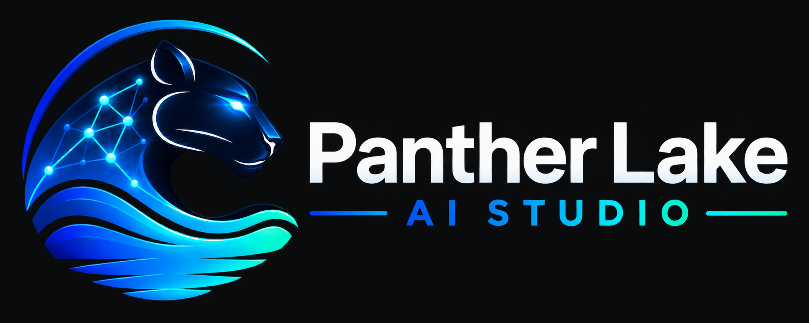
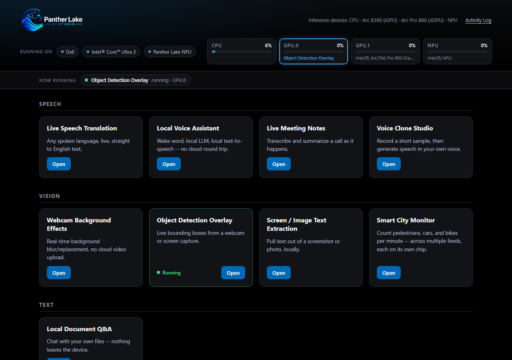
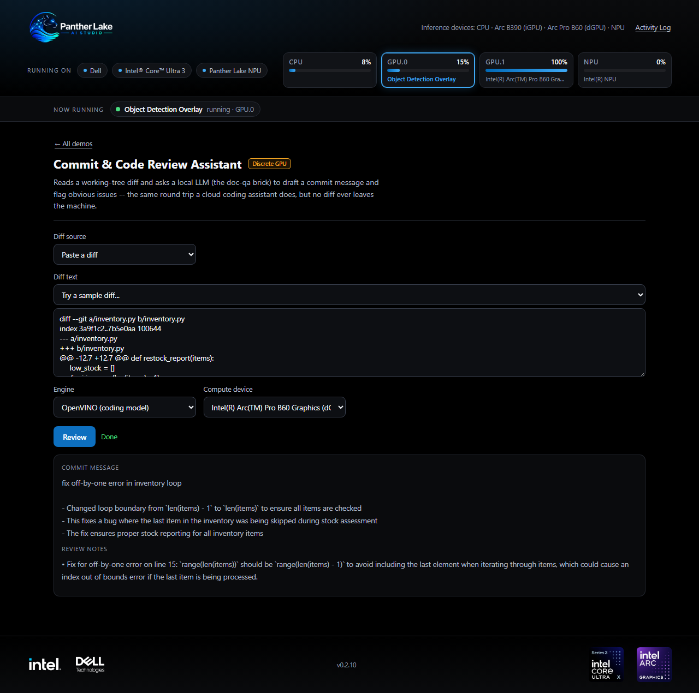
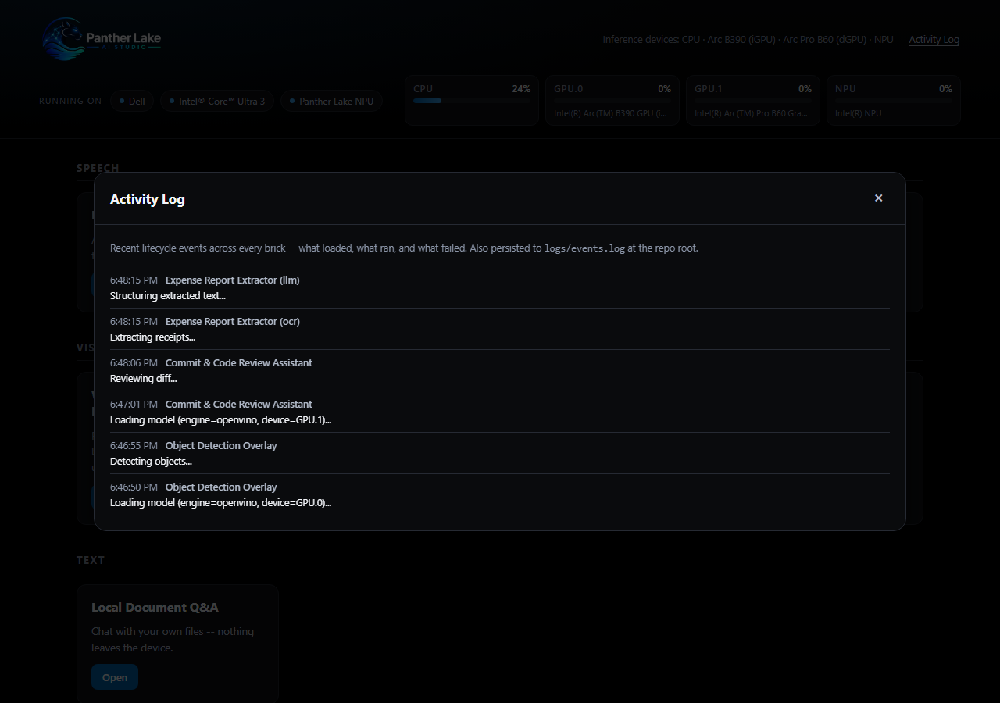

<p align="center">
  
</p>

<p align="center">
  <a href="https://github.com/Arnaud-Intel/ptl-ai-studio/tags"></a>
  <a href="pyproject.toml"></a>
  <a href="https://docs.openvino.ai/"></a>
  
  
</p>

**A local AI Studio for Intel Panther Lake -- a dozen on-device AI demos,
one launcher, zero cloud calls.**

Speech translation. A voice assistant that talks back in your own voice.
Live meeting notes. Object detection. Receipt-to-spreadsheet automation
that runs your NPU and GPU *at the same time*. Every demo here runs
entirely on the machine in front of you -- no API key, no network call,
no data that leaves the device -- and every one of them can point
directly at your Intel CPU, integrated GPU, or NPU and show you, on a
live gauge, exactly which chip is doing the work.

This isn't a slide deck about on-device AI. It's twelve working
applications that prove it.

## See it in 60 seconds

```bash
git clone https://github.com/Arnaud-Intel/ptl-ai-studio.git
cd ptl-ai-studio
uv sync --extra openvino
uv run panther-lake-launcher
```

A local web UI opens at `http://127.0.0.1:8765`, demos grouped by the
kind of work they do: pick one, hit Launch -- it defaults to OpenVINO on
your NPU/iGPU/GPU when available, portable CPU otherwise -- and the
status line tells you what's actually happening (downloading a model the
first time, loading it from disk after, or running), instead of a static
"please wait." Then watch the CPU/GPU/NPU gauges in the header light up
with *which demo is using which chip, right now*. If your machine has
more than one GPU (say, an iGPU plus a discrete Arc card), each gets its
own gauge, tracked independently -- point two different demos at two
different GPUs and watch both light up at once. That live attribution is
real, not decorative: it comes from the exact device string each demo
handed the inference runtime, not a guess.

<p align="center">
  
</p>

## The demo suite

### Speech

| Demo | What it does | Runs on |
| --- | --- | --- |
| **Live Speech Translation** | Any spoken language, live, straight to English text | CPU / NPU / GPU |
| **Local Voice Assistant** | Say a wake word, ask a question, hear a spoken answer | CPU / NPU / GPU |
| **Live Meeting Notes** | Transcribes a call and generates a running summary + action items on demand | CPU / NPU / GPU |
| **Voice Clone Studio** | Enroll a 10-second voice sample, then speak any text back in that voice | CPU / NPU / GPU |

### Vision

| Demo | What it does | Runs on |
| --- | --- | --- |
| **Webcam Background Effects** | Real-time background blur or replacement, no video ever leaves the machine | CPU / NPU / GPU |
| **Object Detection Overlay** | Live labeled bounding boxes over a webcam or screen feed | CPU / NPU / GPU |
| **Screen / Image Text Extraction** | Pull text out of a screenshot or photo, with optional on-device translation | CPU / GPU |

### Text

| Demo | What it does | Runs on |
| --- | --- | --- |
| **Local Document Q&A** | Chat with your own files -- retrieval-augmented, nothing indexed in the cloud | CPU / NPU / GPU |

### Productivity

| Demo | What it does | Runs on |
| --- | --- | --- |
| **Expense Report Extractor** | Photograph a folder of receipts, get a structured CSV -- OCR and the LLM run *concurrently* on two different chips | GPU **+** NPU, at once |
| **Local Screen Memory** | Continuously indexes your own screen so you can semantically search it later -- OCR and embedding run *concurrently*, the same way | GPU **+** NPU, at once |
| **Commit & Code Review Assistant** | Turn a git diff into a commit message and review notes, entirely locally | CPU / GPU\* |
| **HTML Creator** | Describe a page or point at a folder of documents, get one self-contained HTML file back | CPU / GPU\* |

*Every "Runs on" cell is real, tested hardware routing -- not a spec
sheet claim. `expense-extract` and `smart-recall` are the showcase: each
runs OCR on one chip while a second model (an LLM, or an embedder) works
on a *different* chip at the same time -- both gauges lit simultaneously,
proof captured live from the telemetry API during testing, not claimed
from a spec sheet. \*These two ask for a 30B-parameter coding model on
the OpenVINO engine (~15GB) -- too large for an iGPU's or NPU's memory
budget, so that path needs a real **discrete** GPU with its own VRAM
(flagged with an amber "Discrete GPU" tag in the launcher). The portable
engine still runs everywhere, with a much smaller model.*

<p align="center">
  
</p>

Every content-hungry demo also ships with a "Try a sample" picker --
named example prompts, diffs, and questions, including a fictional
company's documents (`sample-data/`) for `doc-qa` and `html-creator`'s
document mode -- so there's always something real to click Launch on
without hunting for your own files first.

Also on the roadmap and already visible as "Coming soon" cards in the
launcher: an inbox triage & draft assistant, and live noise suppression
-- the suite is built to keep growing without touching what already
ships.

## Why this is worth a look

- **Genuine hardware routing, not a toggle that does nothing.** Every
  switchable-backend demo runs [OpenVINO](https://docs.openvino.ai/) for
  the Intel path, because `faster-whisper`, PyTorch, and ONNX Runtime's
  default provider are CPU/CUDA-only -- they physically cannot target an
  NPU or iGPU. OpenVINO is what actually exposes `CPU` / `GPU` / `NPU` as
  selectable devices on a chip like Panther Lake, which is the entire
  point of demonstrating *local* AI *on this hardware*, not just on a
  laptop.
- **Composable, not copy-pasted.** Twelve demos, and the newest ones
  barely add code: `meeting-notes` has no transcriber or LLM of its own
  -- it composes `live-translation` and `doc-qa` directly.
  `code-review-assist` and `html-creator` add zero new model code either,
  each composing `doc-qa`'s LLM for a different task. `voice-assistant`
  composes three bricks and adds exactly one new model (wake-word
  detection). Shared capture, VAD, and device-discovery code lives in one
  `core` package every brick depends on.
- **Verified against real hardware, not assumed.** This suite was built
  and tested against an actual Intel NPU and Arc GPU, end to end, down to
  finding (and routing around) a real OpenVINO NPU compiler limitation on
  a 7B vision-language model -- documented, not hidden, in
  [`screen-ocr`'s README](bricks/screen-ocr/README.md).
- **Know what's happening, not just that it's "loading."** First-time
  model loads can take a minute or more, so the launcher tracks each
  demo's real lifecycle -- downloading, loading, running, or error -- and
  keeps a persisted Activity Log of what happened, reviewable from the
  footer at any time.
- **One launcher, no build step.** The front end is vanilla HTML/CSS/JS
  served straight from FastAPI -- no npm install, no bundler, just
  `uv run panther-lake-launcher`.

<p align="center">
  
</p>

## Command line, if you'd rather skip the UI

Every demo also installs its own console script:

```bash
uv run live-translate --source system --engine openvino --compute-device NPU
uv run voice-assistant --engine openvino --compute-device NPU
uv run voice-clone-studio --record 15 --text "Hello from my own cloned voice."
uv run expense-extract ./receipts --ocr-engine openvino --ocr-device GPU --llm-engine openvino --llm-device NPU
uv run smart-recall record --ocr-engine openvino --ocr-device GPU --embed-engine openvino --embed-device NPU
uv run code-review-assist --folder . --engine openvino --compute-device GPU
uv run html-creator --prompt "a landing page for a small coffee shop" --engine openvino --compute-device GPU
```

See each brick's own README for its full set of options.

## Under the hood

One [`uv` workspace](https://docs.astral.sh/uv/concepts/projects/workspaces/),
one shared `.venv`, every brick and the launcher installed together so
they can depend on each other freely. Full layout, the pattern for adding
a new brick, and the auto-versioning mechanism (the badge at the top of
this page updates itself on every merge to `main`) are in
[CONTRIBUTING.md](CONTRIBUTING.md).

---

Built for [Dell](https://www.dell.com/) hardware powered by
[Intel(R) Core(TM) Ultra](https://www.intel.com/) and
[Intel(R) Arc(TM) Graphics](https://www.intel.com/) -- see it running live
in the launcher's own footer.
