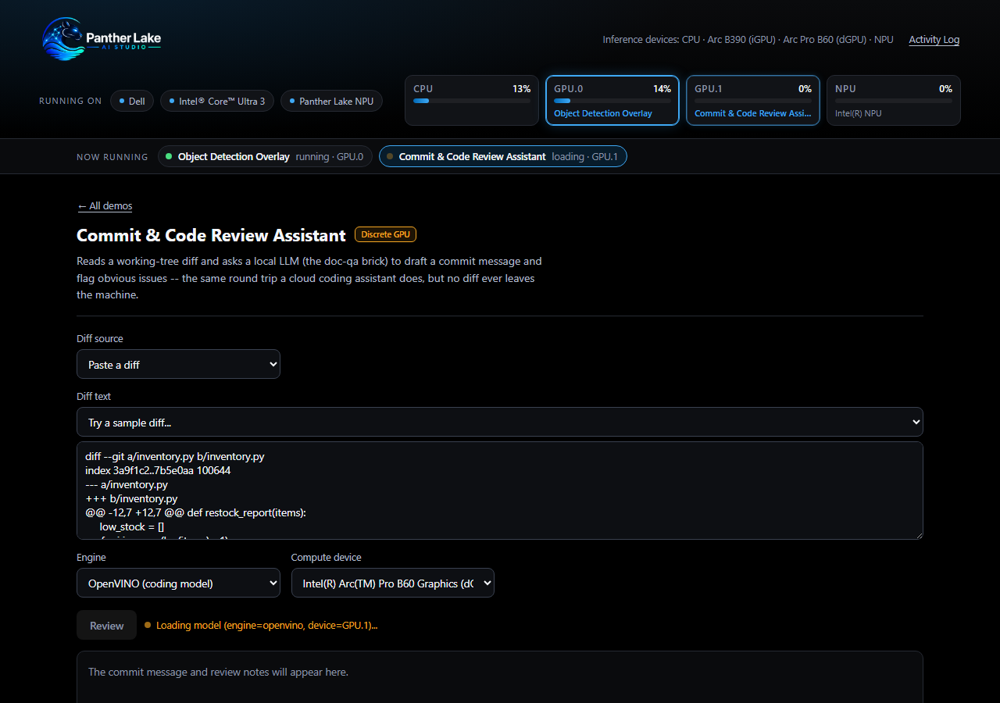
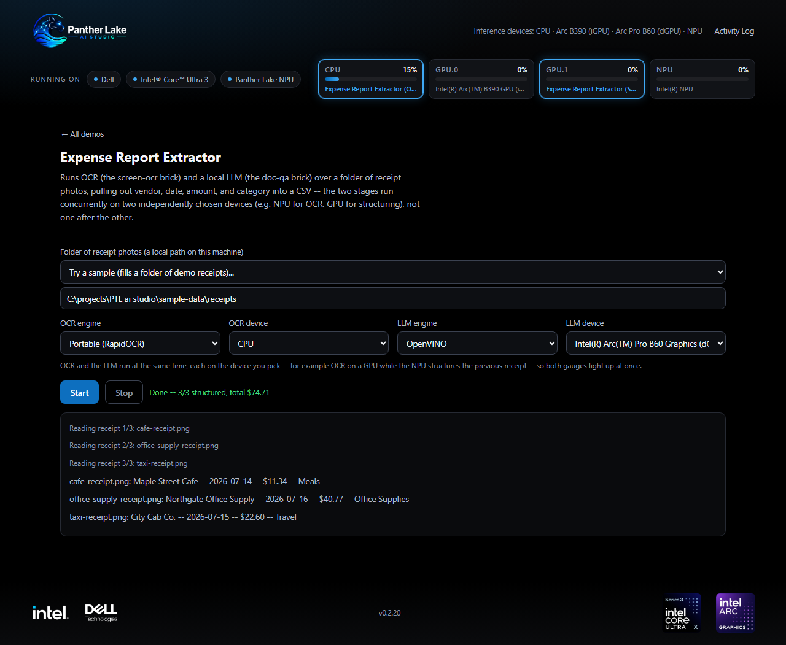

<p align="center">
  
</p>

<p align="center">
  <a href="https://github.com/Arnaud-Intel/ptl-ai-studio/tags"></a>
  <a href="pyproject.toml"></a>
  <a href="https://docs.openvino.ai/"></a>
  
  
  <a href="https://github.com/Arnaud-Intel/ptl-ai-studio/actions/workflows/test.yml"></a>
</p>

**A local AI Studio for Intel Panther Lake -- thirteen on-device AI demos,
one launcher, zero cloud calls.**

Speech translation. A voice assistant that talks back in your own voice.
Live meeting notes. Object detection. Receipt-to-spreadsheet automation
that runs your CPU and GPU *at the same time*. Every demo here runs
entirely on the machine in front of you -- no API key, no network call, no
data that leaves the device -- and every one can be pointed at your Intel
CPU, integrated GPU, or NPU and show you, on a live gauge, exactly which
chip is doing the work.

This isn't a slide deck about on-device AI. It's thirteen working
applications that prove it.

## Get it running

The only real prerequisite is [`uv`](https://docs.astral.sh/uv/getting-started/installation/)
-- it fetches a compatible Python itself, so there's no separate Python
install to get right:

```bash
git clone https://github.com/Arnaud-Intel/ptl-ai-studio.git
cd ptl-ai-studio
uv sync --extra openvino
uv run panther-lake-launcher
```

That opens `http://127.0.0.1:8765` in your browser. On Windows you can
also just **double-click `start_launcher.bat`** -- same thing, in a window
you can leave open and close to stop the server.

<details>
<summary><b>What you need, and what the flags mean</b></summary>

- **`uv sync`** installs every demo with its portable (CPU) engine.
  **`uv sync --extra openvino`** additionally installs the OpenVINO engines
  -- the ones that can target your iGPU and NPU. Use the `--extra` form on
  Intel hardware; plain `uv sync` still gives you a fully working suite on
  CPU. (`uv sync` makes the environment match exactly what you ask for, so
  a later plain `uv sync` *removes* the OpenVINO extras again -- keep
  passing `--extra openvino`.)
- **Windows 11** for the full experience: the CPU/GPU/NPU gauges read
  Windows' own performance counters, and "capture system audio" uses WASAPI
  loopback. The demos themselves run elsewhere; the gauges just report
  `N/A`.
- **Models download on first use**, not at install: from ~100 MB for the
  small speech models up to ~15 GB for the two coding demos. The status
  line tells you when it's downloading rather than leaving you guessing,
  and every run after that is fully offline.
- **No Intel accelerator?** Everything still runs -- each demo falls back
  to its portable CPU engine, and the OpenVINO option is disabled in the UI
  with the reason shown.

</details>

<p align="center">
  
</p>

## What it's like to use

Open a demo and press Start. It defaults to OpenVINO on your NPU/iGPU/GPU
when one is available and portable CPU otherwise, and the status line says
what is *actually* happening -- downloading a model the first time, loading
it from disk after, running, or stopping -- instead of a static "please
wait".

**Leaving a demo doesn't stop it.** Start object detection on the iGPU, go
back to the grid, open the code review assistant on the discrete GPU: the
"Now running" strip under the header keeps both in view wherever you are,
each gauge names the demo driving it, and reopening a demo picks up exactly
where it is -- the video reattaches, an index built five minutes ago is
still there.

<p align="center">
  
</p>

That attribution is real, not decorative: it comes from the exact device
string each demo handed the inference runtime, not a guess. A demo left on
`AUTO` lights no gauge at all rather than claim a chip it might not be
using.

## The demo suite

### Speech

| Demo | What it does | Runs on |
| --- | --- | --- |
| **Live Speech Translation** | Any spoken language, live, straight to English text | CPU / NPU / GPU |
| **Local Voice Assistant** | Say a wake word, ask a question, hear a spoken answer | CPU / NPU / GPU |
| **Live Meeting Notes** | Transcribes a call and generates a running summary + action items on demand | CPU / NPU / GPU |
| **Voice Clone Studio** | Enroll a 10-second voice sample, then speak any text back in that voice | CPU / NPU / GPU |

### Vision

| Demo | What it does | Runs on |
| --- | --- | --- |
| **Webcam Background Effects** | Real-time background blur or replacement, no video ever leaves the machine | CPU / NPU / GPU |
| **Object Detection Overlay** | Live labeled bounding boxes over a webcam or screen feed | CPU / NPU / GPU |
| **Screen / Image Text Extraction** | Pull text out of a screenshot or photo, with optional on-device translation | CPU / GPU † |
| **Smart City Monitor** | Count pedestrians/cars/bikes per minute across several video files -- each pinnable to its own chip | CPU / NPU / GPU **each**, at once |

### Text

| Demo | What it does | Runs on |
| --- | --- | --- |
| **Local Document Q&A** | Chat with your own files -- retrieval-augmented, nothing indexed in the cloud | CPU / NPU / GPU |

### Productivity

| Demo | What it does | Runs on |
| --- | --- | --- |
| **Expense Report Extractor** | Point it at a folder of receipts, get structured expense lines -- OCR and the LLM run *concurrently* on two different chips | two chips, at once |
| **Local Screen Memory** | Continuously indexes your own screen so you can semantically search it later -- OCR and embedding run *concurrently*, the same way | two chips, at once |
| **Commit & Code Review Assistant** | Turn a git diff into a commit message and review notes, entirely locally | CPU / GPU ‡ |
| **HTML Creator** | Describe a page, or point at a folder of documents, and get one self-contained HTML file back | CPU / GPU ‡ |

Every "Runs on" cell is tested hardware routing, not a spec-sheet claim.

† Screen / Image Text Extraction's OpenVINO engine is a 7B
vision-language model. Its NPU compile fails on this hardware, so the NPU
is offered but disabled with the reason shown, rather than left to fail
with a compiler error -- see [`screen-ocr`'s README](bricks/screen-ocr/README.md).

‡ These two ask for a 30B-parameter coding model on the OpenVINO engine
(~15 GB) -- too large for an iGPU's or NPU's memory budget, so that path
wants a real **discrete** GPU with its own VRAM (flagged with an amber
"Discrete GPU" tag in the launcher). The portable engine still runs
everywhere, with a much smaller model.

### The concurrency showcase

`expense-extract` and `smart-recall` are the ones to watch: each runs OCR
on one chip while a second model -- an LLM, or an embedder -- works on a
*different* chip at the same time, both gauges lit and labelled with the
stage driving them. `smart-city-monitor` generalises the same idea to N:
pin each video feed to its own chip and every one it's using lights up at
once, correctly attributed per feed.

<p align="center">
  
</p>

Every content-hungry demo ships with a "Try a sample" picker -- named
example prompts, diffs and questions, a fictional company's documents
(`sample-data/`) for `doc-qa` and `html-creator`'s document mode, and three
synthetic receipts for `expense-extract` -- so there's always something
real to press Start on without hunting for your own files first.

Also on the roadmap and already visible as "Coming soon" cards: an inbox
triage & draft assistant, and live noise suppression.

## Why this is worth a look

- **Genuine hardware routing, not a toggle that does nothing.** Every
  switchable-backend demo runs [OpenVINO](https://docs.openvino.ai/) for
  the Intel path, because `faster-whisper`, PyTorch and ONNX Runtime's
  default provider are CPU/CUDA-only -- they physically cannot target an
  NPU or iGPU. OpenVINO is what actually exposes `CPU` / `GPU` / `NPU` as
  selectable devices on a chip like Panther Lake, which is the whole point
  of demonstrating *local* AI *on this hardware*.
- **Composable, not copy-pasted.** Thirteen demos, and the newest ones
  barely add code: `meeting-notes` has no transcriber or LLM of its own --
  it composes `live-translation` and `doc-qa` directly.
  `code-review-assist` and `html-creator` add no model code either, each
  composing `doc-qa`'s LLM for a different task. `smart-city-monitor`
  composes `object-detection`'s detector, adding only tracking, counting
  and multi-feed. `voice-assistant` composes three bricks and adds exactly
  one new model (wake-word detection). Shared capture, voice-activity
  detection, device discovery and model resolution live in one `core`
  package every brick depends on.
- **Verified against real hardware, not assumed.** Built and tested
  against an actual Intel NPU and Arc GPUs, end to end -- down to finding,
  and routing around, two real OpenVINO limitations: a 7B vision-language
  model that won't compile for the NPU, and the same model failing under
  the `AUTO` device. Both documented rather than hidden.
- **Honest about what it's doing.** First-time model loads can take
  minutes, so the launcher tracks each demo's real lifecycle --
  downloading, loading, running, stopping, or failed -- and keeps a
  persisted Activity Log of what happened, reachable from the header at any
  time. Press Stop on a demo that's mid-inference and it says "Stopping"
  until it genuinely has, rather than claiming to still be working.
- **One launcher, no build step.** The front end is vanilla HTML/CSS/JS
  served straight from FastAPI -- no npm install, no bundler.

<p align="center">
  
</p>

## Command line, if you'd rather skip the UI

Every demo installs its own console script, and they take the same
engine/device choices as the UI:

```bash
uv run live-translate --source system --engine openvino --compute-device NPU
uv run voice-assistant --engine openvino --compute-device NPU
uv run voice-clone-studio --record 15 --text "Hello from my own cloned voice."
uv run expense-extract ./receipts --ocr-engine openvino --ocr-device GPU --llm-engine openvino --llm-device NPU
uv run smart-recall record --ocr-engine openvino --ocr-device GPU --embed-engine openvino --embed-device NPU
uv run code-review-assist --folder . --engine openvino
uv run html-creator --prompt "a landing page for a small coffee shop" --engine openvino
uv run smart-city-monitor --source "intersection.mp4|GPU.0" --source "crosswalk.mp4|NPU" --engine openvino
```

Every one of them takes `--list-devices` to show what this machine can
actually target, and `--help` for the rest. See each brick's own README
for the detail.

## If something goes wrong

- **"only one usage of each socket address"** on startup -- a launcher is
  already running on port 8765. Close it, or start this one somewhere else
  with `uv run panther-lake-launcher --port 8766`.
- **A demo seems stuck on its first run** -- it's almost certainly
  downloading a model. The status line says so explicitly, and the
  **Activity Log** in the header has the history, including anything that
  failed and why.
- **The UI looks wrong after an update** -- reload the page. Assets are
  cache-busted per build, but a tab left open across an update can hold an
  older copy.

## Under the hood

One [`uv` workspace](https://docs.astral.sh/uv/concepts/projects/workspaces/),
one shared `.venv`, every brick and the launcher installed together so they
can depend on each other freely. The full layout, the pattern for adding a
brick, the test suite (`uv run pytest` -- pure logic plus the launcher's
API contract, run on every push) and the auto-versioning mechanism (the
badge at the top updates itself on every merge to `main`) are in
[CONTRIBUTING.md](CONTRIBUTING.md).

---

Built for [Dell](https://www.dell.com/) hardware powered by
[Intel(R) Core(TM) Ultra](https://www.intel.com/) and
[Intel(R) Arc(TM) Graphics](https://www.intel.com/) -- see it running live
in the launcher's own footer.
