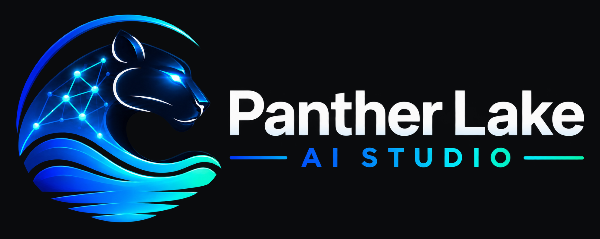
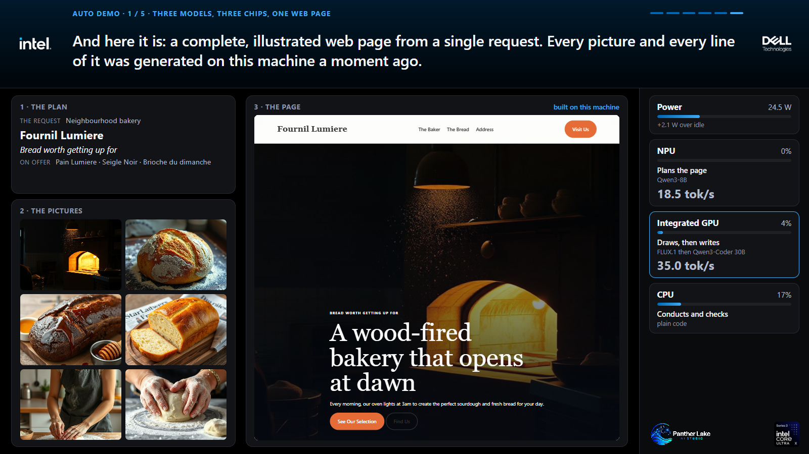
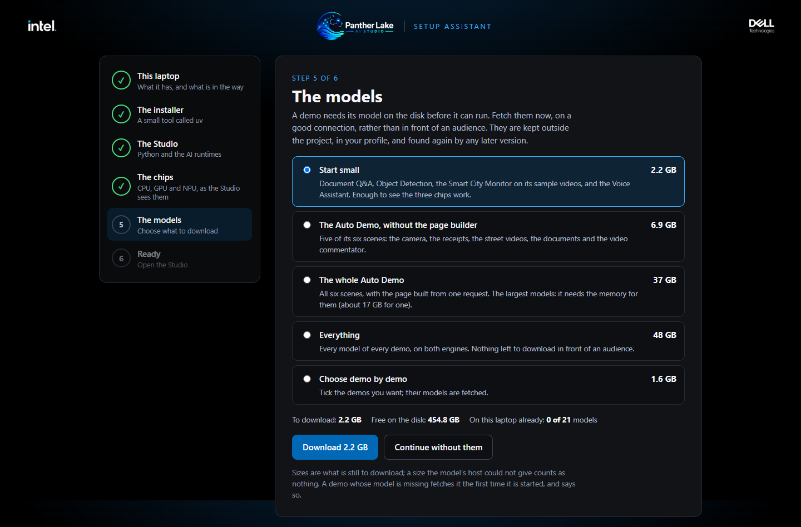
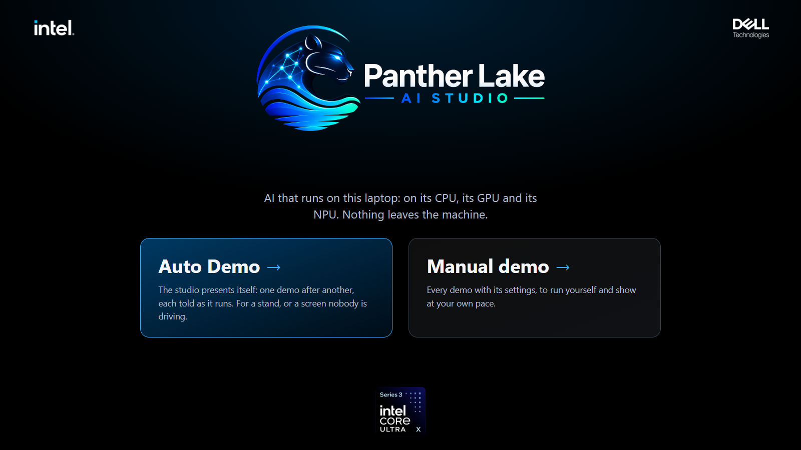
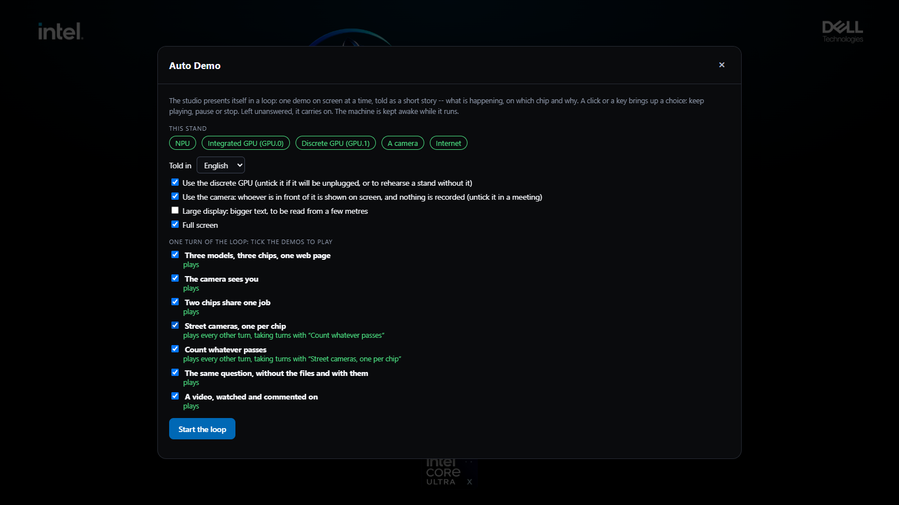
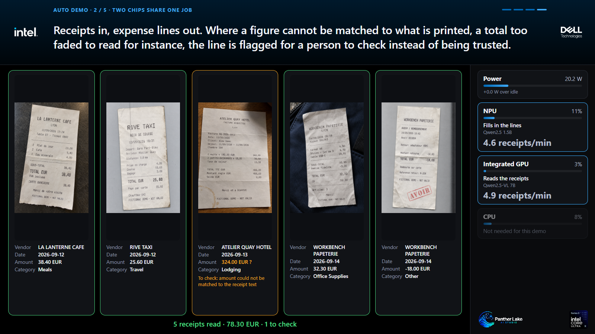
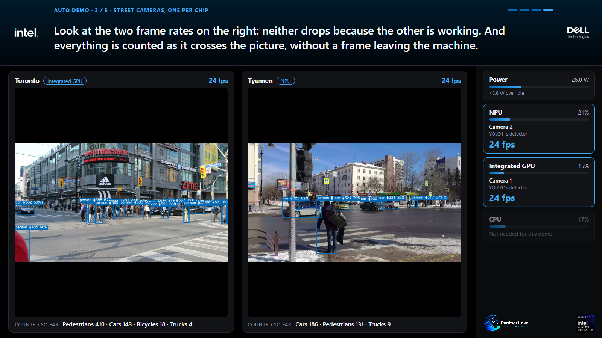
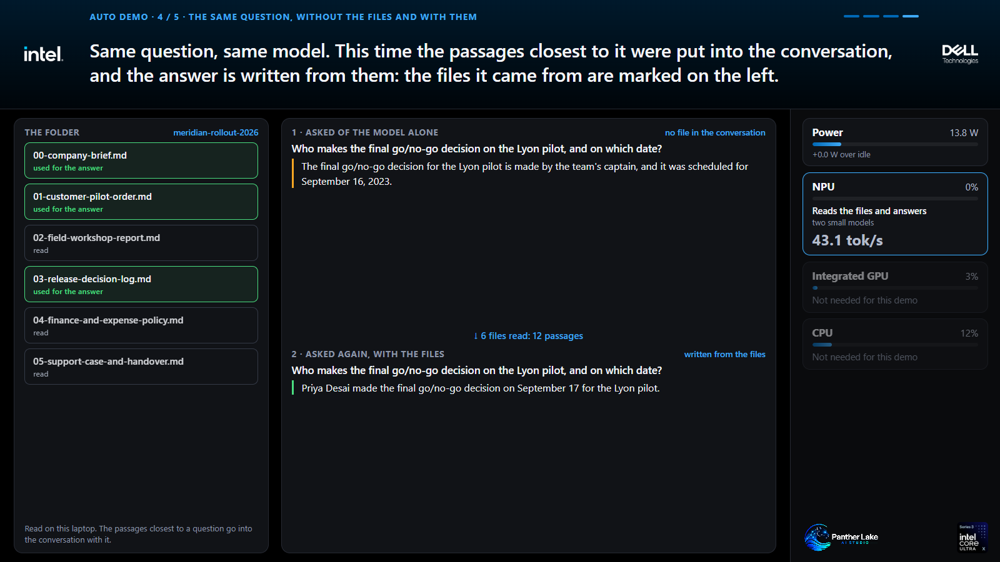
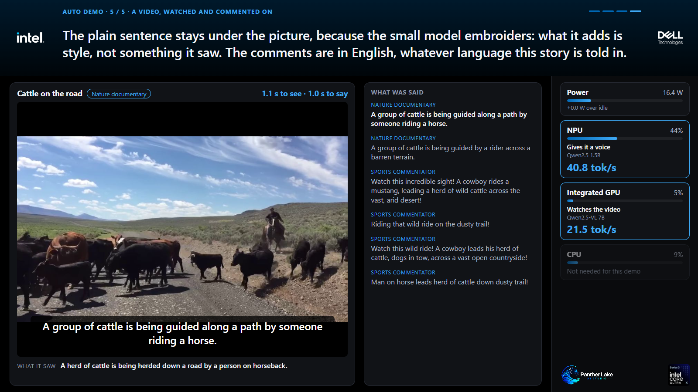
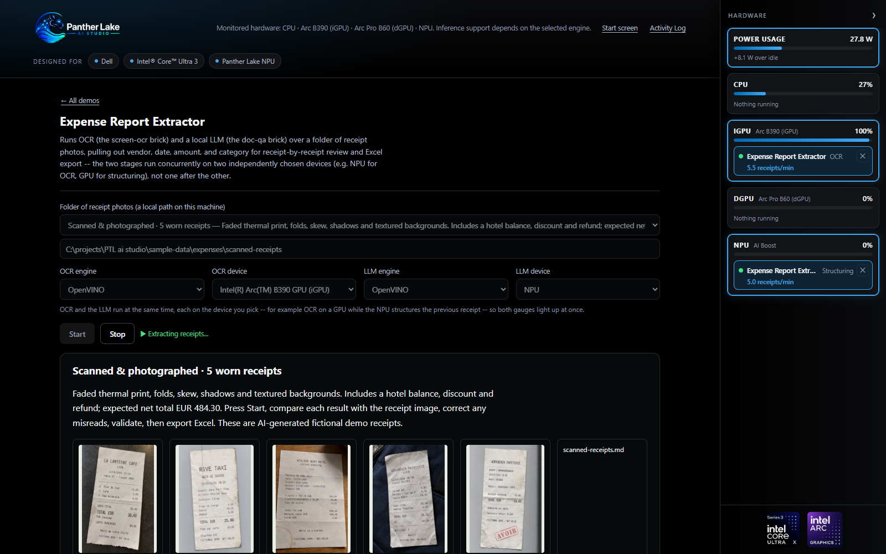

<p align="center">
  
</p>

<p align="center">
  <a href="https://github.com/Arnaud-Intel/ptl-ai-studio/tags"></a>
  
  <a href="https://docs.openvino.ai/"></a>
  
  
  <a href="https://github.com/Arnaud-Intel/ptl-ai-studio/actions/workflows/test.yml"></a>
</p>

**Fifteen AI demos that run on the laptop in front of you, and a show that
plays them by itself. For Intel Core Ultra laptops: Lunar Lake and Panther
Lake. One launcher, no cloud.**

- **Every demo runs on the machine**: no API key, no account, nothing sent
  anywhere. Once its models are downloaded it works with the network off.
- **You choose the chip** -- CPU, integrated GPU or NPU -- and a hardware
  panel shows which one is working, how fast, and how many watts it costs.
- **Auto Demo** plays the demos in a loop and tells each one as a short
  story, in English or French: for a stand, a meeting, or a screen nobody
  is driving.

<p align="center">
  
</p>
<p align="center"><sub>One request, one web page: planned on the NPU, illustrated and written on the integrated GPU, in under four minutes, with no graphics card.</sub></p>

## Which laptops

| | Lunar Lake | Panther Lake |
| --- | --- | --- |
| Processor | Intel Core Ultra 200V series | Intel Core Ultra series 3 |
| Chips the demos use | CPU, Arc integrated GPU, NPU | CPU, Arc integrated GPU, NPU |
| System | Windows 11, current Intel graphics and NPU drivers | the same |

- **No graphics card is needed.** A discrete GPU is used when there is one
  (the Page Agent then runs its two GPU jobs at once) and never required.
- **Memory decides which demos fit.** The models live in system memory,
  which the integrated GPU shares. Most demos need a few gigabytes; the
  three that use the 30B coding model (HTML Creator, Code Review, Page
  Agent) need about 17 GB for it, and say so on their cards. Code Review
  and HTML Creator can run a 1.5B model on the CPU instead.
- **What was measured where.** Every figure and screenshot on this page
  comes from a Panther Lake laptop (Dell XPS 14, Core Ultra X7 358H, 64 GB).
  A Lunar Lake laptop runs the same build on the same three chips, at its
  own speeds.
- **Another PC?** The demos fall back to their CPU engines, and the options
  that need an Intel GPU or NPU are greyed out with the reason.

## Install on a new device

Nothing has to be installed first: no Python, no git, no administrator
rights. You need Windows 11, an internet connection for the installation,
and disk space: 2 GB for the Studio, then the models you choose, from 2 GB
for a first look to nearly 50 GB for all of them.

1. **Update the Intel drivers** (graphics and NPU), for instance with the
   [Intel Driver & Support Assistant](https://www.intel.com/content/www/us/en/support/detect.html).
   The assistant does not touch drivers, and the NPU demos need a recent one.
2. **Get the project.** **Code > Download ZIP** on this page, then
   right-click the ZIP and **Extract All**. Or, with git, which is what
   lets the app upgrade itself later:
   ```bash
   git clone https://github.com/Arnaud-Intel/ptl-ai-studio.git
   ```
3. **Double-click `first_launch.bat`** in the extracted folder. Windows
   may warn about a file that came from the internet: *More info*, then
   *Run anyway*. A setup page opens in the browser and walks through six
   steps; it shows what it found, asks before each download, and when a
   step fails it says what to do about it.

   | Step | What happens |
   | --- | --- |
   | 1. This laptop | Processor, memory, disk, drivers, the folder and the internet are checked; what would stop the installation is said before anything is downloaded |
   | 2. The installer | [`uv`](https://docs.astral.sh/uv/) is found, or fetched: with winget, or into the project folder (25 MB) |
   | 3. The Studio | Python and the AI runtimes are installed into the project folder: 2 GB, from two minutes to a quarter of an hour |
   | 4. The chips | The runtime that was just installed is asked which of CPU, GPU and NPU it can really use |
   | 5. The models | You choose a set, with its size: a small start, the Auto Demo, everything, or demo by demo |
   | 6. Ready | A desktop shortcut if you want one, and the Studio opens on `http://127.0.0.1:8765` |

4. **From then on, double-click `start_launcher.bat`** (or the shortcut).
   Close its window to stop the Studio, or run `stop_launcher.bat`.

<p align="center">
  
</p>

The assistant can be run again: what is already downloaded is kept, and
each step's log is in `logs/setup-*.log`. It changes no security setting,
and what it installs stays in the project folder and in your own profile
(Python, the installer's cache, the models). On a company network that inspects
secure connections, it offers to try again with the certificates Windows
trusts; a proxy that blocks the downloads is for your IT team to settle.
`first_launch.bat console` does the same steps as questions in the black
window, and is what you get if the page cannot be served.

<details>
<summary><b>Installing by hand, offline use, updates</b></summary>

```bash
git clone https://github.com/Arnaud-Intel/ptl-ai-studio.git
cd ptl-ai-studio
uv sync --extra openvino      # without --extra: CPU engines only
uv run panther-lake-launcher
```

- **Models** are fetched the first time a demo needs them. To fetch them
  ahead, use **Prepare models** in the footer (what each is for, its size,
  whether this machine has it), or `uv run panther-lake-prefetch`
  (`--list` to look, `--demo doc-qa` for one demo).
- **Offline.** Install and fetch the models first; after that the Studio
  starts and runs with the network off. Only live city cameras and the
  update check want a connection.
- **Updates.** A copy made with git checks GitHub when it starts and offers
  the new version with what changed; **Upgrade** in the footer does the
  rest and restarts. A copy from a ZIP is updated by downloading it again.
- **YouTube city cameras** in the Smart City demo also need Deno or Node;
  `first_launch.bat console` checks and offers to install Deno. Everything
  else works without. See the [Smart City notes](bricks/smart-city-monitor/README.md#connection-recovery-and-setup-checks).

</details>

## Two ways in

<p align="center">
  
  
</p>

### Auto Demo

The Studio presents itself: one demo on screen at a time, a caption that
says what is happening and on which chip, and the chips at work down the
right. Before it starts you choose the language, which scenes play, and
whether the camera may be used. A click brings up *keep playing*, *pause*
or *stop*; left alone, it carries on. It makes no sound.

| Scene | What it shows | Chips |
| --- | --- | --- |
| Three models, three chips, one web page | A request becomes an illustrated page: planned, drawn, written | NPU + GPU |
| The camera sees you | Whoever is in front is boxed live, and a vision model says what is going on. Nothing is recorded | NPU + GPU |
| Two chips share one job | Five worn receipts become expense lines; a doubtful figure is flagged, not trusted | GPU + NPU |
| Street cameras / Count whatever passes | Two videos counted at once, one per chip: streets one turn, a herd and a bottling line the next | GPU + NPU |
| The same question, without the files and with them | Asked of the model alone it makes something up; asked again with the files, it answers from them | NPU |
| A video, watched and commented on | A plain sentence about each frame, then said again as a sports commentator or a nature documentary | GPU + NPU |

<p align="center">
  
  
</p>
<p align="center">
  
  
</p>

How it is built, and what was measured: [docs/AUTO_DEMO.md](docs/AUTO_DEMO.md).

### Manual demo

Every demo with its settings. Open one, pick an engine and a chip, press
Start. Leaving a demo does not stop it: the hardware panel keeps every
running demo in view under the chip it is on, with its own figure (frames
or tokens per second) and a button to stop it. Demos that need content
come with samples: a fictional company's documents, receipts, street
videos, prompts.

<p align="center">
  
</p>

## The demos

| Demo | What it does | Chips |
| --- | --- | --- |
| **Live Speech Translation** | Any spoken language to English text, live | CPU · GPU · NPU |
| **Live Meeting Notes** | Transcribes a call; summary and action items on demand | CPU · GPU · NPU |
| **Local Voice Assistant** | Wake word, question, spoken answer | CPU · GPU · NPU (the voice itself on the CPU) |
| **Voice Clone Studio** | Enrol a short voice sample, then speak any text in that voice | CPU (GPU possible, slower) |
| **Webcam Background Effects** | Background blur or replacement, live | CPU · NPU |
| **Object Detection Overlay** | Labelled boxes on a video file, a webcam or the screen | CPU · GPU · NPU |
| **Screen / Image Text Extraction** | Reads the text in a screenshot or a photo, and can translate it | CPU · GPU |
| **Smart City Monitor** | Counts people, cars and bikes on videos or live cameras | one chip per feed |
| **Video Commentator** *(experimental)* | Watches a video and says what is happening, in a mood, aloud if you like | GPU + NPU |
| **Local Document Q&A** | Answers from your own files and names them; can be asked without them, to compare | CPU · GPU · NPU |
| **Expense Report Extractor** | A folder of receipts to reviewed expense lines and an Excel file | two chips at once |
| **Local Screen Memory** | Indexes what was on screen so it can be searched later | two chips at once |
| **Commit & Code Review Assistant** | A git diff to a commit message and review notes | CPU · GPU |
| **HTML Creator** | A description, or a folder of documents, to one self-contained web page | CPU · GPU |
| **Page Agent** *(experimental)* | One request to an illustrated page: three models, conducted by plain code | NPU + GPU |

Each demo is a "brick" with its own README under [`bricks/`](bricks), and
its own command:

```bash
uv run doc-qa ./my-notes --engine openvino --compute-device NPU
uv run object-detect --source file --engine openvino --compute-device GPU
uv run expense-extract ./receipts --ocr-engine openvino --ocr-device GPU --llm-engine openvino --llm-device NPU
```

`--list-devices` shows what the machine can target; `--help` has the rest.

## Good to know

- **The numbers are real.** A chip's row shows the device the demo handed
  to OpenVINO, not a guess. Power is the processor's own energy counter,
  and an answer says what it cost over idle.
- **It says what it cannot do.** A model that does not compile for a chip
  is greyed out with the reason; a figure the receipts demo cannot find on
  the receipt is flagged; the commentator shows what it saw beside what it
  said.
- **A first run is slow.** A demo downloads its model, then compiles it for
  the chip; the status line says which. The Activity Log (top right) has
  the history, errors included.
- **Voices are made on the CPU.** The speech-synthesis models do not
  compile for the NPU, so the Voice Assistant listens and answers on the
  chip you pick and speaks from the CPU, and the Voice Clone Studio shows
  the NPU greyed out with the reason.
- **Port taken?** A Studio is already running: `stop_launcher.bat`, or
  start another with `uv run panther-lake-launcher --port 8766`.

## For contributors

One [`uv` workspace](https://docs.astral.sh/uv/concepts/projects/workspaces/):
a `core` package, one package per brick, and a FastAPI launcher with a
plain HTML/CSS/JS front end, no build step. Bricks reuse each other rather
than copy: Meeting Notes has no model of its own, the Smart City Monitor
borrows the detector, the Commentator borrows the vision model.
[CONTRIBUTING.md](CONTRIBUTING.md) has the layout, how to add a brick and
the tests (`uv run pytest`, run on every push); [BACKLOG.md](BACKLOG.md)
has what is planned and what is known to be wrong.

The sample videos are openly licensed and credited in
[`sample-data/videos`](sample-data/videos/README.md); the sample documents
and receipts are fictional.

---

Built for [Dell](https://www.dell.com/) laptops with
[Intel(R) Core(TM) Ultra](https://www.intel.com/) processors and
[Intel(R) Arc(TM)](https://www.intel.com/) graphics.
